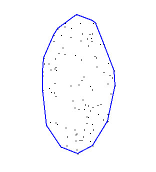
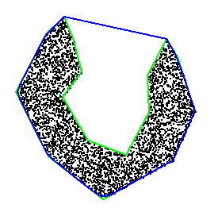

<script id="MathJax-script" async
  src="https://cdn.jsdelivr.net/npm/mathjax@3/es5/tex-mml-chtml.js">
</script>

# draw_convex_hull
![clang-format and tests][1]

A QT program that draws the convex hull of randomly generated points.
* Requires at least CMake 3.16 to compile and build.
* Set the __CMAKE_PREFIX_PATH__ the location of the Qt installation. For example something like: _...Qt/5.14.1/gcc_64/lib/cmake/Qt5Widgets/_ .

The built executable creates a configurable convex hull demo. The user can
 * choose the number of randomly generated points from which a convex hull is generated
 * pick a fast, ( $n * log(n)$ ) convex hull algorithm, or the quadratic implementation.
 
```
Required parameters: 
--num  [Int] number of points to generate
--fast [Boolean] 'true' for the n*log(n) implemenation of convex hull algorithm
Ex.
 draw_convex_hull_demo --num 10000 --fast true
```



#### Capabilities

* Given a simple closed 2D polygon generate a point-in-polygon predicate. In the image below one sees several thousand randomly
generated points that were masked (or filtered) by ```PointInPolygon``` of the polygon marked in green. For comparison, 
the convex hull of the polygon is shown in blue.



[1]: https://github.com/arvsrao/draw_convex_hull/workflows/CI/badge.svg
